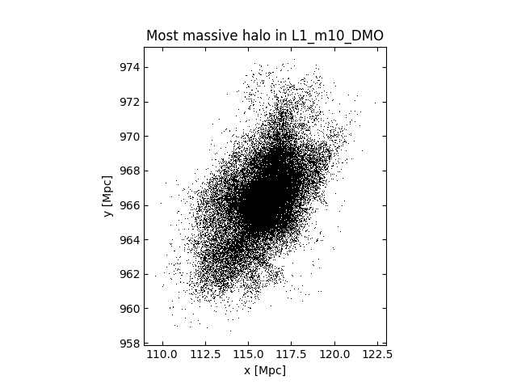

Reading particles belonging to a halo
=====================================

Here we show how to identify a halo of interest in a :doc:`SOAP halo
catalogue </soap/index>` and then find its particles in the
corresponding :doc:`snapshot </snapshots/index>`. This could be used
to compute a halo density profile, for example.

In the SOAP halo catalogues, each halo is assigned an index which is
unique within the snapshot (but not between snapshots). This index is
stored in the HDF5 dataset ``InputHalos/HaloCatalogueIndex``. There is
a corresponding index ``PartTypeX/HaloCatalogueIndex`` associated with
each particle in the snapshot.

We can read in all particles belonging to a halo as follows:

  * Use swiftsimio to read the halo catalogue (see :doc:`/soap/swiftsimio`)
  * Identify a halo of interest in the catalogue
  * Extract the position and ``HaloCatalogueIndex`` of this halo from the SOAP catalogue
  * Read particles from the snapshot in some radius around the halo position (see :ref:`swiftsimio_cutouts`)
  * Discard particles which do not have the required ``HaloCatalogueIndex``

This can be done either by using the :doc:`hdfstream python module
</service_docs/python_module>` for remote access, or by downloading
the SOAP catalogue and snapshot as HDF5 files and reading them
directly with h5py. Both methods are illustrated below.

.. tab-set::

   .. tab-item:: Using remote file access

      .. code-block:: python

         import numpy as np
         import unyt
         import hdfstream
         import swiftsimio as sw

         # Connect to the hdfstream service and open the root directory
         root_dir = hdfstream.open("cosma", "/")

         # Open the z=0 halo catalogue from the L1_m10_DMO simulation
         soap_file = root_dir["FLAMINGO/L1_m10/L1_m10_DMO/SOAP-HBT/halo_properties_0077.hdf5"]
         soap = sw.load(soap_file)

         # Get halo positions, masses and indexes
         halo_pos = soap.input_halos.halo_centre
         halo_m200c = soap.spherical_overdensity_200_crit.total_mass
         halo_index = soap.input_halos.halo_catalogue_index

         # Select the most massive halo
         i = np.argmax(halo_m200c)
         target_pos = halo_pos[i,:]
         target_index = halo_index[i]

         # Choose a region to read in. Note that we need to choose a radius large
         # enough to enclose all halo particles.
         radius = 5.0*unyt.Mpc
         region = [[x-radius, x+radius] for x in target_pos]

         # Open the z=0 snapshot from the L1_m10_DMO simulation and select this region
         snap_file = root_dir["FLAMINGO/L1_m10/L1_m10_DMO/snapshots/flamingo_0077/flamingo_0077.hdf5"]
         mask = sw.mask(snap_file)
         mask.constrain_spatial(region)
         snap = sw.load(snap_file, mask=mask)

         # Read position and halo index of dark matter particles in this region
         dm_pos = snap.dark_matter.coordinates
         dm_halo_index = snap.dark_matter.halo_catalogue_index

         # Of the particles we read, identify those which belong to the halo
         in_halo = (dm_halo_index == target_index)
         halo_dm_pos = dm_pos[in_halo,:]

         # Make a simple dotplot as a sanity check
         import matplotlib.pyplot as plt
         plt.plot(halo_dm_pos[:,0], halo_dm_pos[:,1], "k,")
         plt.gca().set_aspect("equal")
         plt.xlabel("x [Mpc]")
         plt.ylabel("y [Mpc]")
         plt.title("Most massive halo in L1_m10_DMO")
         plt.show()

   .. tab-item:: Reading local HDF5 files

      .. code-block:: python

         import numpy as np
         import unyt
         import swiftsimio as sw

         # Open the z=0 halo catalogue from the L1_m10_DMO simulation
         soap_file = "./FLAMINGO/L1_m10/L1_m10_DMO/SOAP-HBT/halo_properties_0077.hdf5"
         soap = sw.load(soap_file)

         # Get halo positions, masses and indexes
         halo_pos = soap.input_halos.halo_centre
         halo_m200c = soap.spherical_overdensity_200_crit.total_mass
         halo_index = soap.input_halos.halo_catalogue_index

         # Select the most massive halo
         i = np.argmax(halo_m200c)
         target_pos = halo_pos[i,:]
         target_index = halo_index[i]

         # Choose a region to read in. Note that we need to choose a radius large
         # enough to enclose all halo particles.
         radius = 5.0*unyt.Mpc
         region = [[x-radius, x+radius] for x in target_pos]

         # Open the z=0 snapshot from the L1_m10_DMO simulation and select this region
         snap_file = "./FLAMINGO/L1_m10/L1_m10_DMO/snapshots/flamingo_0077/flamingo_0077.hdf5"
         mask = sw.mask(snap_file)
         mask.constrain_spatial(region)
         snap = sw.load(snap_file, mask=mask)

         # Read position and halo index of dark matter particles in this region
         dm_pos = snap.dark_matter.coordinates
         dm_halo_index = snap.dark_matter.halo_catalogue_index

         # Of the particles we read, identify those which belong to the halo
         in_halo = (dm_halo_index == target_index)
         halo_dm_pos = dm_pos[in_halo,:]

         # Make a simple dotplot as a sanity check
         import matplotlib.pyplot as plt
         plt.plot(halo_dm_pos[:,0], halo_dm_pos[:,1], "k,")
         plt.gca().set_aspect("equal")
         plt.xlabel("x [Mpc]")
         plt.ylabel("y [Mpc]")
         plt.title("Most massive halo in L1_m10_DMO")
         plt.show()

This results in the following plot showing dark matter particles in the halo:

